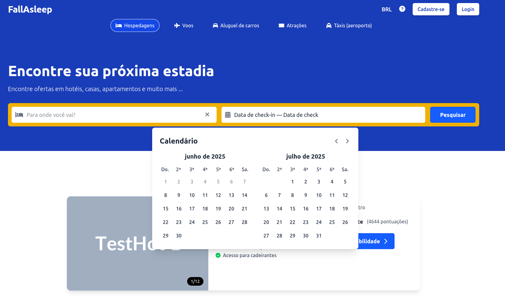
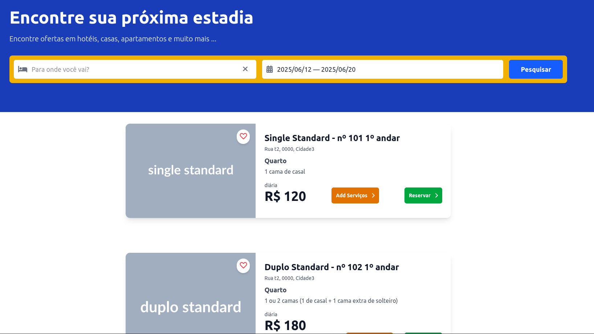
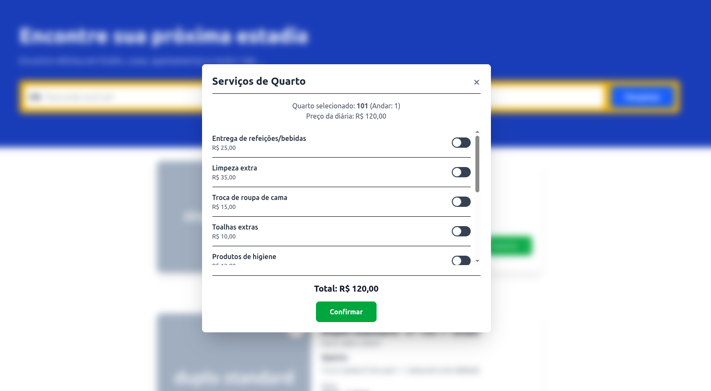
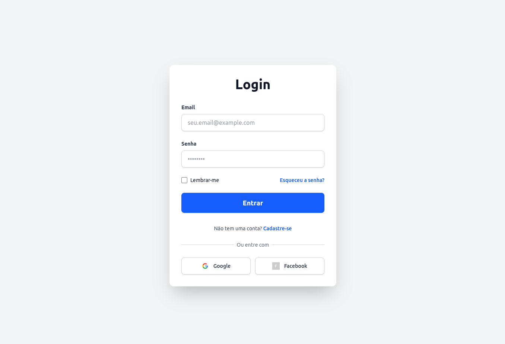
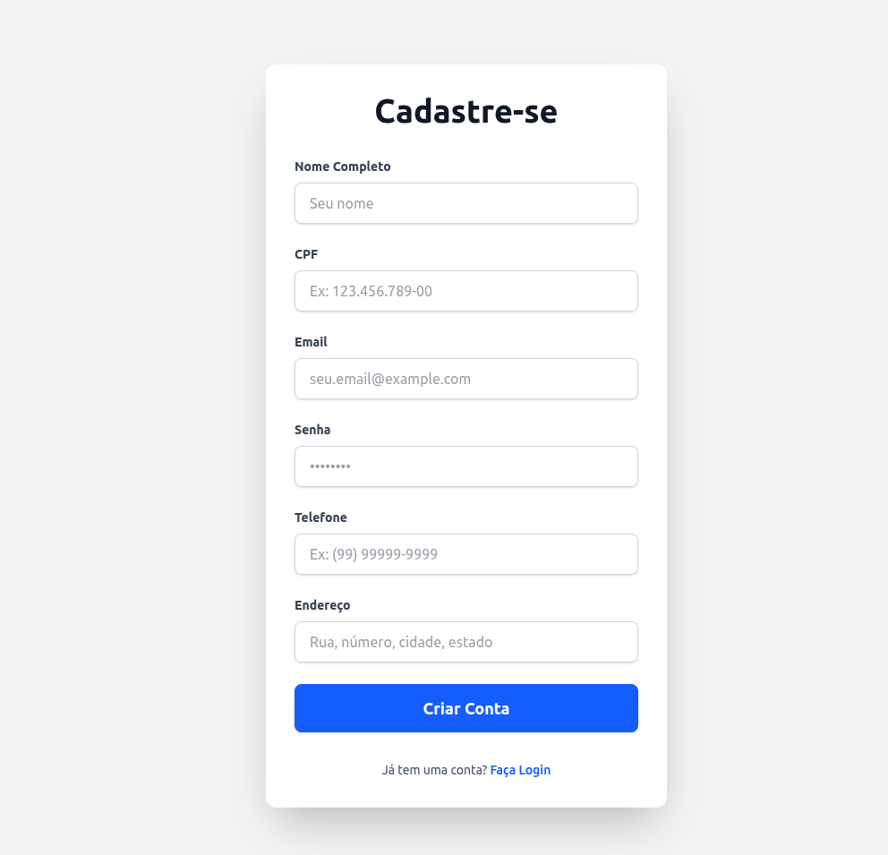

# Hotel

Site para reservar quartos de hotel no Brasil

<p align="center">
  
  
</p>
<p align="center">
  
  
</p>
<p align="center">
  
  
</p>

## Rodando localmente

Clone o projeto

```bash
  git clone https://link-para-o-projeto
```

Entre no diretório do projeto

```bash
  cd hotel
```

Rode o comando a seguir dentro da pasta "postgres+pgadmin"

```bash
  docker compose up -d
```

Volte e abra a pasta "Backend" e inicie o servidor

```bash
  env java @/tmp/cp_6416nm7j3lv93z1j2fa7352l1.argfile com.lrittes.Hotel.HotelApplication
```

Volte e abra a pasta "frontend" e Instale as dependências

```bash
  npm install
```

Inicie a aplicação web

```bash
  npm run start
```

## Autores

- [@lrittes](https://www.github.com/lrittes)
